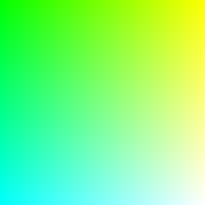
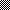
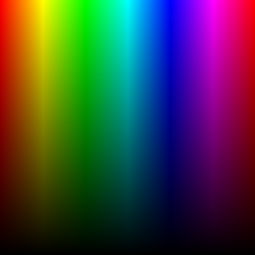

# PNG

## Installation

1. Add the dependency to your `shard.yml`:

   ```yaml
   dependencies:
     PNG:
       github: sleepinginsomniac/png
   ```

2. Run `shards install`

## Usage

### Reading

```crystal
require "png"

canvas = PNG.read("examples/gradient.png")
canvas.header.color_type # => PNG::ColorType::RGB
canvas[0, 0]             # => Bytes[0, 255, 0]
```

### Writing

```crystal
require "png"

canvas = PNG::Canvas.new(255, 255)
0.upto(canvas.height - 1) do |y|
  0.upto(canvas.width - 1) do |x|
    canvas[x, y] = Bytes[x, 255, y]
  end
end

PNG.write("examples/gradient.png", canvas)
```



```crystal
require "png"

canvas = PNG::Canvas.new(255, 255)

0.upto(canvas.height - 1) do |y|
  0.upto(canvas.width - 1) do |x|
    hue = (x / canvas.width) * 360.0
    value = 1 - (y / canvas.height)
    hsv = PNG::HSV.new(hue, 1.0, value)
    rgb8 = PNG::RGB(UInt8).from_hsv(hsv)
    canvas[x, y] = Bytes[rgb8.r, rgb8.g, rgb8.b]
  end
end

PNG.write("examples/test_pattern.png", canvas)
```



```crystal
require "png"

# 1-bit black and white
canvas = PNG::Canvas.new(PNG::Header.new(10, 10, bit_depth: 1, color_type: PNG::ColorType::Grayscale))
0.upto(canvas.height - 1) do |y|
  0.upto(canvas.width - 1) do |x|
    canvas[x, y] = Bytes[1] if (x + y) % 2 == 0
  end
end

PNG.write("examples/1bit_checker.png", canvas)
```



___

#### ColorTypes

All PNG color types and bit depths are supported for reading / writing

| ColorType      | 1bit | 2bit | 4bit | 8bit | 16bit |
|----------------|------|------|------|------|-------|
| Grayscale      | r/w  | r/w  | r/w  | r/w  | r/w   |
| TrueColor      | r/w  | r/w  | r/w  | r/w  | r/w   |
| Indexed        |      |      |      | r/w  |       |
| GrayscaleAlpha | r/w  | r/w  | r/w  | r/w  | r/w   |
| TrueColorAlpha | r/w  | r/w  | r/w  | r/w  | r/w   |

#### FilterMethods

| Name    | Support |
|---------|---------|
| None    | r/w     |
| Sub     | r/w     |
| Up      | r/w     |
| Average | r/w     |
| Paeth   | r/w     |

#### Interlacing

| Name  |     |
|-------|-----|
| None  | r/w |
| Adam7 | r/w |


#### TODO List
- Heuristics for each row to determine the best filter method
- Ancillary Chunks

## Contributing

1. Fork it (<https://github.com/sleepinginsomniac/png/fork>)
2. Create your feature branch (`git checkout -b my-new-feature`)
3. Commit your changes (`git commit -am 'Add some feature'`)
4. Push to the branch (`git push origin my-new-feature`)
5. Create a new Pull Request

## Contributors

- [Alex Clink](https://github.com/sleepinginsomniac) - creator and maintainer
